# Cirql -- WhatsApp Engagement Platform
## System Architecture and Task Register

> **Proposal Reference:** SP-2025-002
> **Developed by:** Lotus Webtek
> **Reference Implementation:** OneProsper
> **Version:** 4.0 | March 2026
> **Companion:** Cirql PRD v4.0

---

## Document Conventions

| Symbol | Meaning |
|---|---|
| SYS | System default (Lotus Webtek platform) |
| TEN | Tenant-level override |
| PRG | Program-level override |
| COO | Coordinator / engagement-level override |
| PAR | Participant-level override (most specific) |
| NEW | Net-new capability beyond original OneProsper scope |
| DEV | Deviation from prior design with rationale |

---

## Terminology

| Product Term | OneProsper Label | Example Alternatives |
|---|---|---|
| Tenant | OneProsper | MentorLink, Dallas Tamil Sangam |
| Program | Cohort | Q1 Mentoring, Thursday Meetups |
| Engagement | Pair | Mentor pair, Group, Event |
| Participant | Buddy / Learner | Mentor / Mentee, Host / Member |
| Role A | Buddy | Mentor, Host, Facilitator |
| Role B | Learner | Mentee, Member, Attendee |
| Session | Session | Meeting, Class, Meetup |

All labels are tenant-configurable. The system schema uses product terms. The UI renders tenant-configured labels.

---

## Table of Contents

1. [Product Context](#1-product-context)
2. [Roles and Ownership](#2-roles-and-ownership)
3. [System Architecture](#3-system-architecture)
4. [WABA Strategy -- Hybrid Model](#4-waba-strategy----hybrid-model)
5. [Configuration Cascade](#5-configuration-cascade)
6. [Engagement Types](#6-engagement-types)
7. [Voice Reminders](#7-voice-reminders)
8. [Phase 1 -- Core Engagement System](#8-phase-1----core-engagement-system-mvp)
9. [Phase 2 -- Intelligence and Participant Voice](#9-phase-2----intelligence-and-participant-voice)
10. [Phase 3 -- Engagement Types and Scale](#10-phase-3----engagement-types-and-scale)
11. [Open Decisions](#11-open-decisions)
12. [Master Task Register](#12-master-task-register)

---

## 1. Product Context

**Cirql** is a multi-tenant WhatsApp engagement platform built and operated by Lotus Webtek. It serves organizations that run structured recurring-session programs -- tutoring, mentoring, coaching, community meetups, and similar formats.

**OneProsper** is the first tenant and the reference implementation. The platform is designed so that every behavior OneProsper requires is expressed as tenant configuration, not as hardcoded logic. Adding a second tenant requires no code changes.

### 1.1 OneProsper Program Structure

| Aspect | Details |
|---|---|
| Session schedule | Sundays only (tenant config: `allowed_session_days = [Sunday]`) |
| Program length | Configurable weeks. Program Manager sets global default; Coordinator overrides per program |
| Pair constraint | One Role A (Buddy) paired with exactly one Role B (Learner) per program cycle |
| Buddy availability | Returns to available pool after a cycle ends |
| Multiple programs | Multiple school cohorts run simultaneously; each scoped to one school |
| Missed sessions | A missed Sunday extends the program by one week. Max extensions and hard cap are configurable |

### 1.2 Organization Map

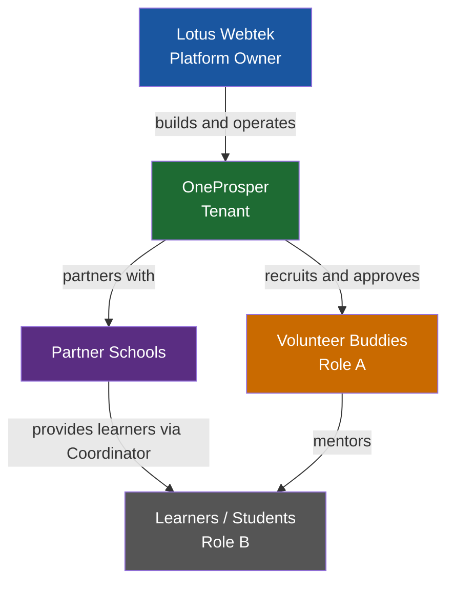

---

## 2. Roles and Ownership

### 2.1 Role Definitions

| Role | Belongs To | Scope |
|---|---|---|
| **SysAdmin** | Lotus Webtek | Full platform access. Tenant management, system config, WABA pool, all logs. Replaces prior "Admin" role. |
| **Tech Support** | Lotus Webtek | System logs and error monitoring. No participant PII. |
| **Program Manager** | Tenant (OneProsper) | Reviews Role A applications, manages participant pool, sets tenant and program defaults, manages form fields and T&C. Cross-program visibility within tenant. |
| **Viewer** | Tenant (OneProsper) | Read-only aggregate stats and reporting. No participant PII. |
| **Coordinator** | School / partner org | Scoped to their school only. Enrolls Role B participants, picks available Role A participants, sets up programs, manages engagements. |
| **Role A Participant** | Volunteer (Buddy) | Their own paired engagement and sessions only. Submits check-ins. |
| **Role B Participant** | Learner | Their own session schedule. Phase 2+. |

> A Coordinator at one school cannot see another school's data under any circumstances -- enforced at the API layer, not just the UI.

> **DEV -- SysAdmin replaces Admin:** The original document had a single "Admin" role held by the dev team. As a product with multiple tenants, Lotus Webtek staff hold SysAdmin (platform-wide), while Program Manager is the highest role within a tenant. This enforces proper tenant isolation.

### 2.2 Role Hierarchy and Data Access

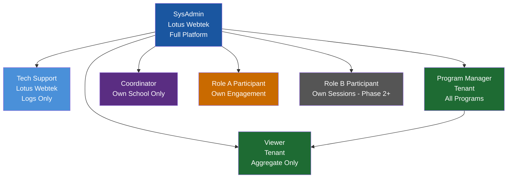

### 2.3 Role A Application and Pool Flow

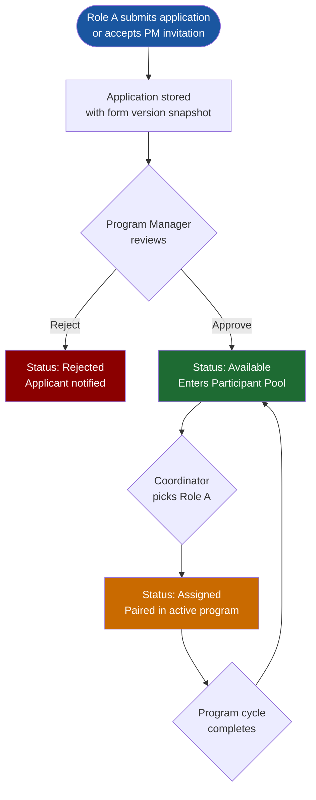

> **Dynamic application fields:** Program Manager can add, edit, or retire application questions and T&C at run-time without code changes. Responses are stored against the form version active at submission.

**Role A application captures:**
- Preferred session day and time slot (IANA timezone)
- Languages spoken
- Age / grade range comfortable mentoring
- Prior teaching or mentoring experience
- Background check consent
- T&C acceptance (versioned)
- Dynamic fields managed by Program Manager

---

## 3. System Architecture

### 3.1 Deployment Stack

> OneProsper instance: single AWS Lightsail instance. All services in Docker Compose. 4GB RAM recommended. The Cirql API service and PostgreSQL are added to the existing stack alongside react-app, n8n, and Ghost.

> NEW -- Multi-tenant note: The same Docker Compose stack serves all tenants on the OneProsper instance. Tenant isolation is enforced at the application and database level via `tenant_id`, not at the infrastructure level. If a future tenant requires dedicated infrastructure, the same application image deploys to a separate instance with no code changes.

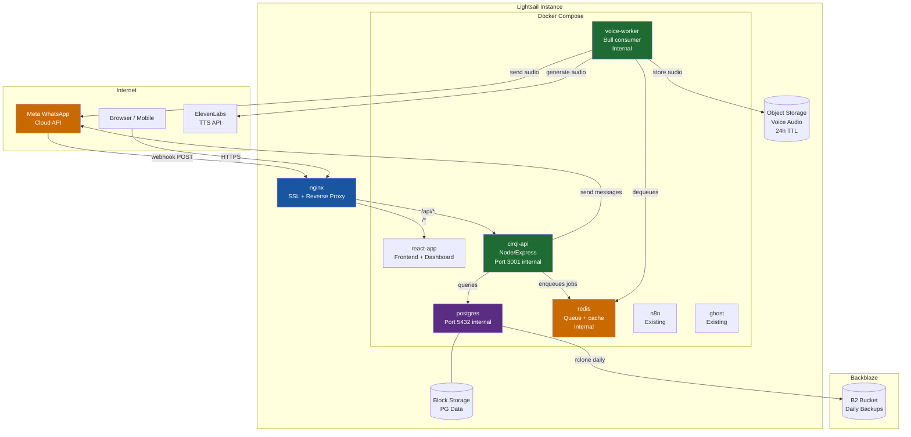

> **DEV -- Redis added:** The original design used pg_cron only for scheduling. Voice message generation requires an async job queue (audio generation can take 2-5 seconds per participant). Redis + Bull provides this without adding a separate service -- the voice worker runs as a Bull consumer inside the same Node process.

### 3.2 Nginx Routing

```nginx
# WhatsApp webhook callbacks from Meta
location /api/whatsapp/ {
    proxy_pass http://cirql-api:3001;
}

# All dashboard REST endpoints
location /api/admin/ {
    proxy_pass http://cirql-api:3001;
}

# Participant preference self-service
location /api/participant/ {
    proxy_pass http://cirql-api:3001;
}

# Existing React site -- unchanged
location / {
    proxy_pass http://react-app;
}
```

### 3.3 Database Schema

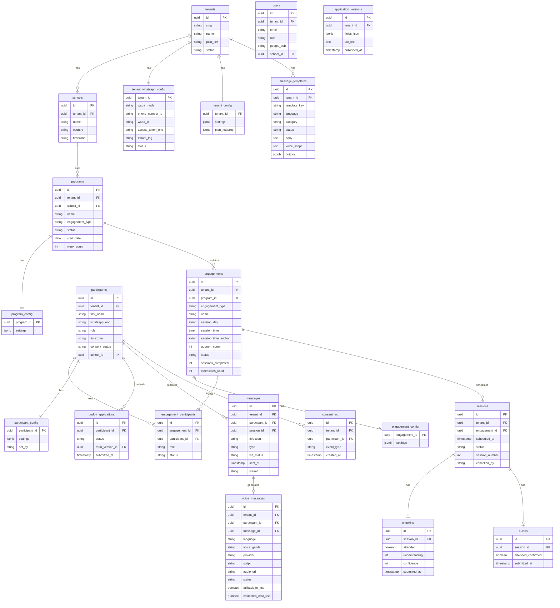

> Phone numbers encrypted at rest using pgcrypto. All timestamps stored in UTC. Timezones stored as IANA identifiers. Sessions validate against `allowed_session_days` in resolved config before being created.

> **DEV -- `pairs` replaced by `engagements` + `engagement_participants`:** The original `pairs` table assumed exactly two participants in fixed roles. The `engagements` table supports all engagement types (1:1, small group, open event, cohort session) through the `engagement_participants` join table. A 1:1 engagement is simply an engagement with two participants in `role_a` and `role_b`. No behavior changes for OneProsper.

> **DEV -- `schools` now scoped to tenant:** The original `schools` table had no `tenant_id`. In a multi-tenant product, schools belong to a specific tenant.

### 3.4 Configuration Cascade

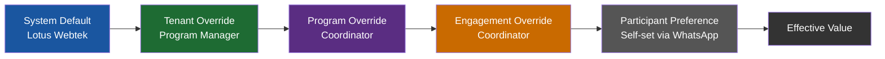

> **DEV -- 5-level cascade replaces 3-level:** The original cascade was System -> Cohort -> Pair. The product cascade adds Tenant and Participant levels. Tenant level is needed because different clients have fundamentally different defaults. Participant level is needed for voice and language preferences, where individual participants may need different settings from their program defaults.

Config is stored as JSONB at each level and merged at resolution time. The most specific non-null value wins.

### 3.5 pg_cron Schedule

| Job | Schedule | Action |
|---|---|---|
| `send_reminders` | Per tenant config (`reminder_lead_hours` before session) | Query sessions due; dispatch text and/or voice reminders per participant effective config |
| `process_checkin_nudges` | Daily 9am UTC | Find sessions with no Role A check-in past deadline; send one nudge |
| `flag_mismatches` | Daily 10am UTC | Compare Role A check-in vs Role B pulse; flag disagreements |
| `extension_processor` | Daily 11am UTC | Identify cancelled sessions; generate extension session; check guardrails |
| `participant_status_refresh` | Daily 6am UTC | Set Role A status back to available for programs completed previous week |
| `voice_cleanup` | Hourly | Delete expired audio files from object storage past 24h TTL |
| `archive_old_logs` | 1st of month 2am UTC | Move old message logs per retention policy |

---

## 4. WABA Strategy -- Hybrid Model

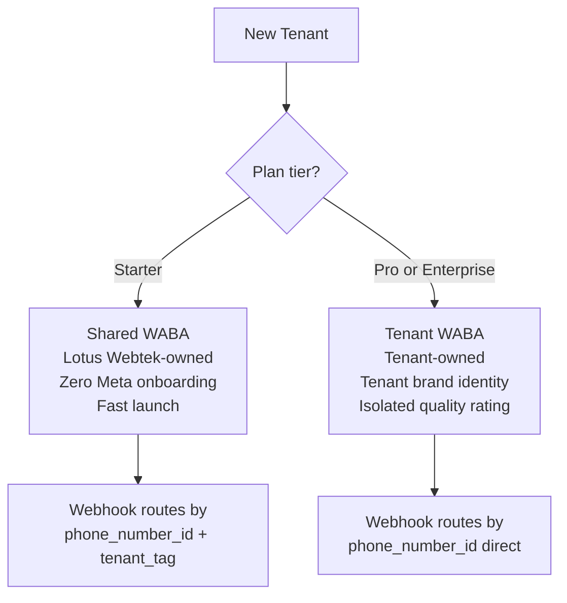

### 4.1 Shared WABA (Lotus Webtek-owned)

- All Starter-tier tenants share one Lotus Webtek phone number and WABA
- Messages show the Lotus Webtek / Cirql sending identity
- Templates are pre-approved -- new tenants go live within minutes of provisioning
- Monthly message cap enforced per tenant per plan tier
- Template body is Lotus Webtek standard; only variable values are tenant-specific
- Quality rating is shared -- a tenant generating complaints affects others

### 4.2 Tenant-Owned WABA

- Tenant connects their own Facebook Business account via Meta Embedded Signup in the admin UI
- Messages show the tenant's own registered business name and number
- Templates are submitted and approved under the tenant's WABA (1-7 day Meta timeline)
- Quality rating is isolated per tenant
- Tenant can obtain Meta green tick verification badge independently
- Meta messaging fees go to the tenant directly or via Lotus Webtek pass-through on Enterprise

### 4.3 OneProsper WABA Config

OneProsper starts on the shared WABA (Starter tier). When they upgrade to Pro:
- They connect their own WABA via the admin UI Embedded Signup flow
- Their templates are resubmitted under the new WABA
- `waba_mode` flips from `shared` to `tenant_owned`
- The Lotus Webtek shared number is released back to the pool

---

## 5. Configuration Cascade

### 5.1 Full Settings Reference

| Setting | Type | SYS Default | Who Can Override | OneProsper Value |
|---|---|---|---|---|
| `allowed_session_days` | day[] | Mon-Sun | TEN, PRG | [Sunday] |
| `max_sessions_per_role_a_per_week` | int | unlimited | TEN, PRG | 1 |
| `session_duration_minutes` | int | 60 | TEN, PRG, COO | 45 |
| `reminder_lead_hours` | int | 24 | TEN, PRG | 24 |
| `checkin_delay_minutes` | int | 30 | TEN, PRG | 30 |
| `nudge_timeout_minutes` | int | 120 | TEN, PRG | 120 |
| `max_session_extensions` | int | 5 | TEN, PRG | 2 |
| `max_total_weeks` | int | unlimited | TEN, PRG | 14 |
| `total_program_sessions` | int | unlimited | TEN, PRG | 10 |
| `coordinator_alert_after_misses` | int | 2 | TEN, PRG | 2 |
| `role_a_language` | string | en | TEN, PRG, COO, PAR | en |
| `role_b_language` | string | en | TEN, PRG, COO, PAR | hi+en |
| `session_time_anchor` | enum | role_b | TEN, PRG, COO | role_b |
| `bilingual_mode` | bool | false | TEN | true |
| `require_consent` | bool | true | not overridable | true |
| `engagement_type` | enum | one_to_one | TEN, PRG | one_to_one |
| `role_a_label` | string | Facilitator | TEN | Buddy |
| `role_b_label` | string | Participant | TEN | Learner |
| `session_label` | string | Session | TEN | Session |
| `program_label` | string | Program | TEN | Cohort |
| `reminder_channel` | enum | text | TEN, PRG, COO, PAR | text |
| `voice_language` | string | en | TEN, PRG, COO, PAR | en |
| `voice_provider` | string | elevenlabs | TEN | elevenlabs |
| `voice_gender` | enum | neutral | TEN, PRG, COO, PAR | neutral |
| `voice_fallback_to_text` | bool | true | TEN | true |
| `waba_mode` | enum | shared | TEN (Pro+) | shared |

---

## 6. Engagement Types

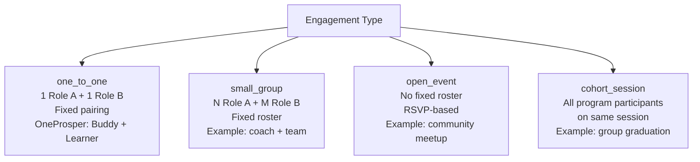

| Flow | one_to_one | small_group | open_event | cohort_session |
|---|---|---|---|---|
| Reminder | Role A + Role B | All roster members | All program participants | All program participants |
| Confirmation | Mutual (both confirm) | Quorum-based | RSVP yes/no/maybe | RSVP |
| Check-in | Role A submits | Designated lead submits | Not applicable | Coordinator marks |
| Missed tracking | Per participant | Per quorum | RSVP vs. attendance | Per attendance |

OneProsper uses `one_to_one` exclusively. Other engagement types are available to future tenants via program config.

---

## 7. Voice Reminders

### 7.1 Overview

Participants can receive session reminders as WhatsApp voice messages in addition to or instead of text. Voice is generated by ElevenLabs TTS and sent as a WhatsApp audio attachment.

`reminder_channel` options: `text` | `voice` | `text_and_voice` | `voice_with_text_fallback`

### 7.2 Config Cascade for Voice

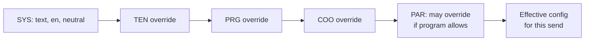

### 7.3 Voice Generation Flow

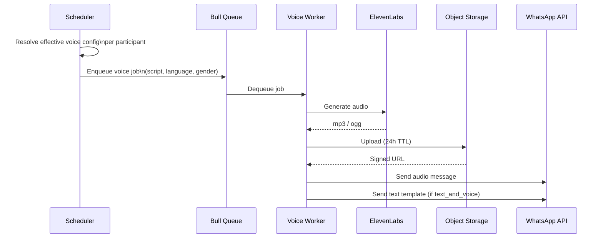

### 7.4 Participant Preference Self-Service

A participant replies "SETTINGS" to any message. The system enters a preference flow:

```
How would you like reminders?
[Text only]  [Voice only]  [Both]

What language?
[English]  [Hindi]  [Tamil]  [Other]
```

Preferences are stored in `participant_config` and applied at the next send. Coordinators can view and override participant preferences in the admin UI.

OneProsper Phase 1 uses `text` channel only. Voice is enabled in Phase 2.

---

## 8. Phase 1 -- Core Engagement System (MVP)

> **Goal:** Run one full OneProsper cohort end-to-end via WhatsApp. Coordinator enrolls learners, picks buddies, sets up Sunday sessions. Participants interact only via WhatsApp button taps. Program Manager approves buddies. Shared WABA. Text reminders only.

### 8.1 Full Session Flow

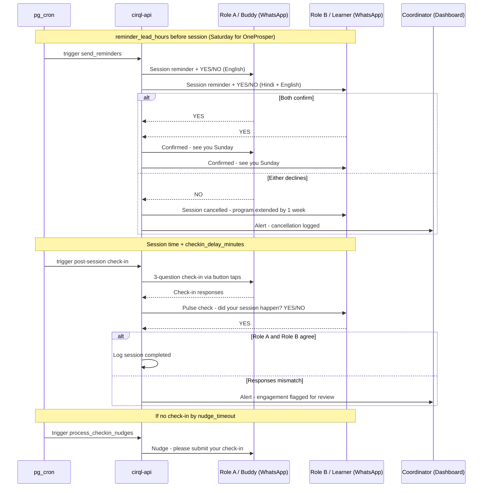

### 8.2 Engagement State Machine

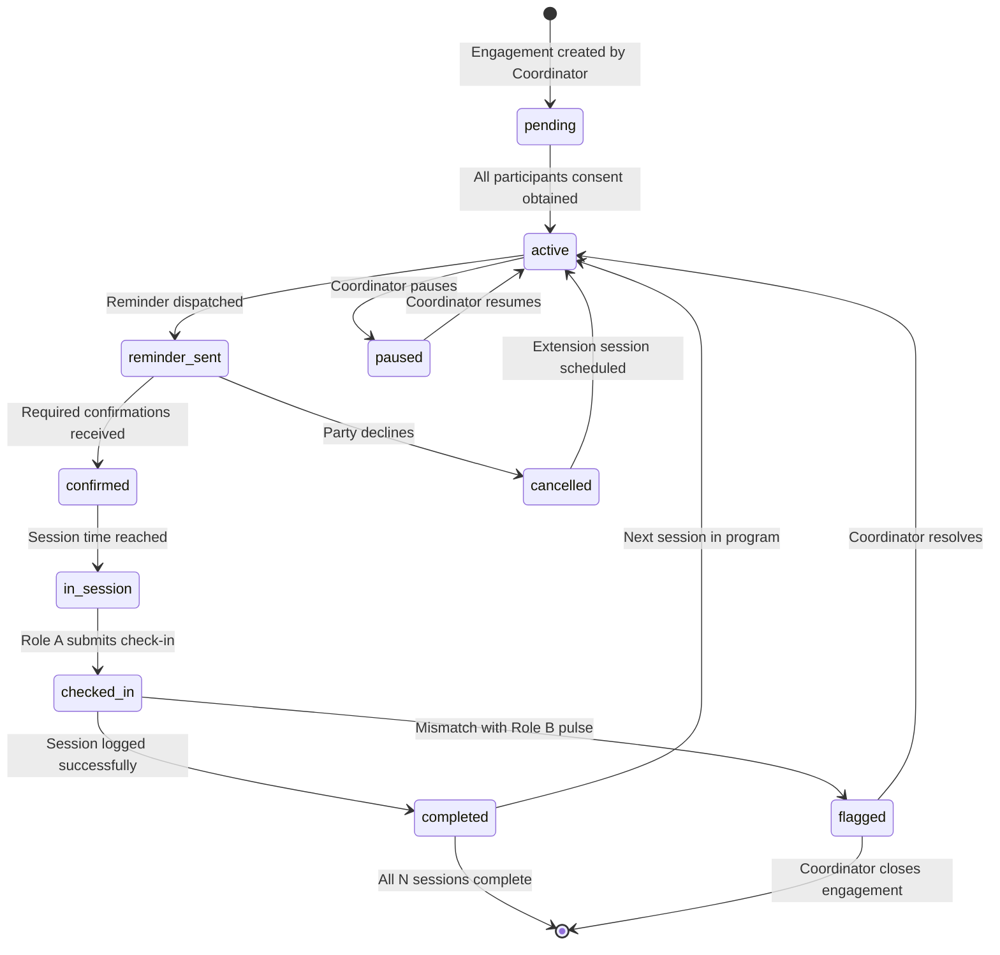

### 8.3 Consent Flow

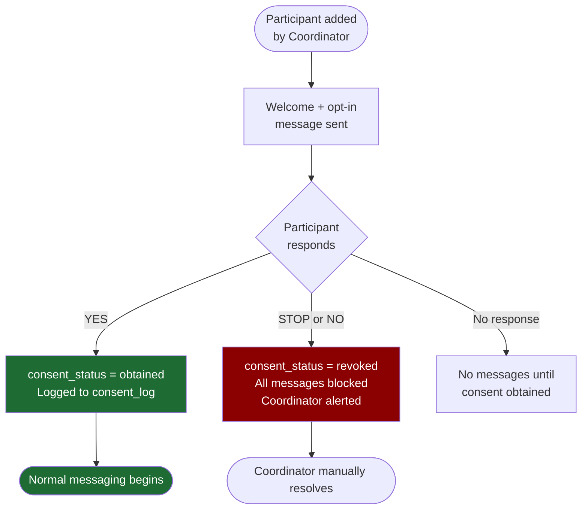

> Consent gate is enforced at the API service level. No outbound message can be dispatched if `consent_status != obtained`, regardless of how the request originates.

### 8.4 Infrastructure Setup

| ID | Task | Notes |
|---|---|---|
| P1-I01 | Confirm Lightsail RAM -- upgrade to 4GB if on 2GB | Redis adds ~100MB; voice worker adds ~100MB |
| P1-I02 | Attach persistent block storage volume for PostgreSQL | Prevents data loss on instance restart |
| P1-I03 | Add `postgres` container to docker-compose.yml | v15+; mount block storage; db init script |
| P1-I04 | Add `cirql-api` container to docker-compose.yml | Node/Express; port 3001 internal; `restart: always` |
| P1-I05 | Add `redis` container to docker-compose.yml | For Bull queue; internal only; `restart: always` |
| P1-I06 | Update nginx config with `/api/*` upstream routes | Add cirql-api:3001 upstream block |
| P1-I07 | Create `.env.example` with all required variables | `PORT, DB_URL, REDIS_URL, WA_TOKEN, WA_PHONE_ID, WA_WEBHOOK_SECRET, GOOGLE_CLIENT_ID, GOOGLE_CLIENT_SECRET, JWT_SECRET, ENCRYPTION_KEY, ELEVENLABS_API_KEY, OBJECT_STORAGE_BUCKET, OBJECT_STORAGE_REGION` |
| P1-I08 | Run database schema migration -- all core tables | Multi-tenant schema per Section 3.3 |
| P1-I09 | Enable pgcrypto extension for phone number encryption | One-time on DB init |
| P1-I10 | Enable pg_cron and register all Phase 1 jobs | See schedule Section 3.5 |
| P1-I11 | Configure daily pg_dump backup to Backblaze B2 | 30-day retention; follows existing backup pattern |
| P1-I12 | Provision Lotus Webtek shared WABA phone number | Register in Meta Business dashboard; store in `tenant_whatsapp_config` |

### 8.5 Multi-Tenant Foundation

| ID | Task | Notes |
|---|---|---|
| P1-MT01 | Implement config cascade resolver | Function accepting (tenant_id, program_id, engagement_id, participant_id) -> effective config JSONB |
| P1-MT02 | Seed system defaults in DB | All SYS-level settings from Section 5.1 |
| P1-MT03 | Build tenant provisioning flow (SysAdmin UI) | Create tenant, set slug, assign plan tier, set WABA mode |
| P1-MT04 | Build shared WABA routing (tenant_tag injection + routing) | Embed tenant_tag in message metadata; extract on inbound webhook |
| P1-MT05 | Build tenant config editor (Program Manager UI) | JSONB editor with cascade source badge per setting |
| P1-MT06 | Seed OneProsper tenant record with reference config | Section 18 of PRD v4.0 |

### 8.6 WhatsApp API Integration

| ID | Task | Notes |
|---|---|---|
| P1-W01 | Configure Meta Cloud API webhook URL in Meta Business dashboard | `https://preview.oneprosper.org/api/whatsapp/webhook` |
| P1-W02 | Implement webhook verification endpoint `GET /api/whatsapp/webhook` | Echo `hub.challenge` within 5 seconds |
| P1-W03 | Implement inbound message handler `POST /api/whatsapp/webhook` | Parse message type; route by tenant_tag (shared) or phone_number_id (tenant-owned) |
| P1-W04 | Implement outbound message sender service | Supports text, interactive buttons, template messages; selects credentials by `waba_mode`; logs every send |
| P1-W05 | Design and submit Phase 1 message templates to Meta | Required: welcome/opt-in, reminder (Role A + Role B), check-in prompt, pulse, nudge, cancellation. Submit early -- 1-5 day approval. |
| P1-W06 | Implement STOP / UNSUBSCRIBE keyword handler | Immediate block; update `consent_status`; write to `consent_log`; dashboard alert |
| P1-W07 | Implement message delivery status handler | Track sent/delivered/read/failed in `messages` table |
| P1-W08 | Implement 24-hour session window guard | Template-only outside 24h window; free-form allowed within window |
| P1-W09 | Implement quick reply button response router | Map YES/NO payloads to session records by participant and session state |

### 8.7 Consent and Onboarding

| ID | Task | Notes |
|---|---|---|
| P1-C01 | Implement welcome + opt-in message trigger on participant creation | No other message until `consent_status = obtained` |
| P1-C02 | Implement consent confirmation handler | On YES: set `consent_status = obtained`; write `consent_log` entry |
| P1-C03 | Enforce consent gate in outbound message sender | Hard block at service level -- not UI-only |
| P1-C04 | Implement opt-out flow (STOP keyword) | Revoke consent; block all future outbound; log; alert Coordinator |
| P1-C05 | Implement Coordinator notification on opt-out | Dashboard alert + optional email |

### 8.8 Role A Application and Pool

| ID | Task | Notes |
|---|---|---|
| P1-B01 | Build dynamic application form engine | Renders fields from `application_fields`; Program Manager controls at run-time |
| P1-B02 | Build application form page (public React route) | Captures all Role A fields; bilingual if configured |
| P1-B03 | Implement application form versioning | Snapshot active fields + T&C into `application_versions` on each submission |
| P1-B04 | Implement Role A invitation flow (Program Manager initiates) | PM enters email/phone; system sends invite; applicant completes form |
| P1-B05 | Build Program Manager application review UI | List pending applications; approve/reject with optional note |
| P1-B06 | Implement participant pool availability logic | Available unless assigned to active program; refreshed by `participant_status_refresh` job |
| P1-B07 | Build Program Manager dynamic form field management UI | Add, edit, deactivate fields; edit T&C; publish new version |

### 8.9 Reminder and Check-in Engine

| ID | Task | Notes |
|---|---|---|
| P1-E01 | Implement reminder scheduler (pg_cron) | Resolve effective config per participant; dispatch per `reminder_channel` (text only in Phase 1) |
| P1-E02 | Implement YES/NO reminder response handler | Track confirmation per participant per session |
| P1-E03 | Implement session cancellation flow | Either party declines: notify other; mark cancelled; trigger extension processor |
| P1-E04 | Implement extension logic | Generate new session for next allowed day; increment `extensions_used`; enforce `max_session_extensions` and `max_total_weeks` |
| P1-E05 | Implement Role A post-session check-in flow | Sent at session time + `checkin_delay_minutes`; 3 questions via button taps |
| P1-E06 | Implement nudge for missing check-in | `nudge_timeout_minutes` after check-in due; one nudge; flag if still no response |
| P1-E07 | Implement Role B pulse check flow | YES/NO: did your session happen? Sent after Role A check-in received |
| P1-E08 | Implement mismatch detection | Compare Role A check-in vs Role B pulse; flag engagement; create Coordinator alert |
| P1-E09 | Implement engagement state machine | States: pending, active, reminder_sent, confirmed, in_session, checked_in, completed, cancelled, flagged, paused |
| P1-E10 | Implement in-flight edit protection | Warn Coordinator editing an engagement in `reminder_sent` or `confirmed` state |

### 8.10 Admin Dashboard

| ID | Task | Notes |
|---|---|---|
| P1-A01 | Implement Google SSO login flow | OAuth 2.0; JWT with role + `tenant_id` + `school_id` claims |
| P1-A02 | Implement role-based route guards (React + API) | Client: hide nav items. API: validate role on every request. School scope enforced at API. |
| P1-A03 | Build school management (SysAdmin only) | Create and manage schools; assign Coordinators |
| P1-A04 | Build user management (SysAdmin + Program Manager) | SysAdmin: all tenants. PM: Coordinator accounts for own tenant. |
| P1-A05 | Build program setup UI (Coordinator) | Create program for their school; set start date, week count; inherit or override defaults |
| P1-A06 | Build Role B enrollment UI (Coordinator) | Add participants; validate phone and timezone; duplicate detection; scoped to Coordinator's school |
| P1-A07 | Build Role A picker UI (Coordinator) | Shows only Available participants; filter by timezone, language, preferred time slot |
| P1-A08 | Build engagement management UI (Coordinator) | Set session day/time; view status; manage extensions; session history |
| P1-A09 | Build session calendar view (Coordinator) | Calendar showing all sessions in program with confirmation and check-in status |
| P1-A10 | Build flagged engagements queue (Coordinator + Program Manager) | Coordinator sees own school; PM sees all. Each flag shows reason and suggested action. |
| P1-A11 | Build audit trail viewer (SysAdmin + Tech Support) | Filterable: consent changes, message sends, state transitions, config changes, admin actions |
| P1-A12 | Build program reporting view (Coordinator + PM + Viewer) | Attendance rate, completion rate, check-in compliance, active vs flagged. Coordinator: own school only. |
| P1-A13 | Build Role A self-service view (Role A participant login) | See paired participant, upcoming session, own check-in history |
| P1-A14 | Build global settings UI (Program Manager + SysAdmin) | Session days, max extensions, nudge timing, language defaults; cascade source badge per setting |

### 8.11 Testing and Deployment

| ID | Task | Notes |
|---|---|---|
| P1-T01 | Set up staging environment | Separate `.env` pointing to test WhatsApp number; same Docker stack; isolated DB |
| P1-T02 | End-to-end test: full 3-session Sunday cycle for one engagement | Reminder -> confirm -> session -> check-in -> pulse -> report updated |
| P1-T03 | Test cancellation and extension flow | Verify extension session falls on correct Sunday; guardrails enforced |
| P1-T04 | Test extension guardrails (`max_session_extensions`, `max_total_weeks`) | Should hard-stop at configured limits |
| P1-T05 | Test STOP / opt-out flow | No messages after STOP; Coordinator alerted; can re-consent |
| P1-T06 | Test mismatch detection | Buddy YES + Learner NO -> flag; Coordinator alert created |
| P1-T07 | Test config cascade resolution | Override at each level; verify most specific wins |
| P1-T08 | Test Sunday-only scheduling for OneProsper | Other days must be rejected by scheduler and UI |
| P1-T09 | Test DST handling for US timezones | Reminder time must be correct across spring/fall DST transitions |
| P1-T10 | Test Coordinator school scope enforcement | Coordinator A cannot see or modify School B data via API |
| P1-T11 | Test participant pool availability logic | Assigned participant does not appear in picker; returns after cycle ends |
| P1-T12 | Test dynamic application form versioning | Old applications retain snapshot of form at submission time |
| P1-T13 | Test shared WABA tenant_tag routing | Inbound message routes to correct tenant handler |
| P1-T14 | Test multi-tenant data isolation | Tenant A data inaccessible to Tenant B at API level |
| P1-T15 | Load test webhook handler at 20 concurrent engagements | Validate response time < 5s for Meta webhook verification |
| P1-T16 | Pilot with one live OneProsper school cohort | Real participants; monitor for 2 full Sundays before full rollout |
| P1-T17 | Write Coordinator onboarding runbook | Step-by-step: create program, enroll learners, pick buddies, set up sessions |

---

## 9. Phase 2 -- Intelligence and Participant Voice

> **Goal:** Deeper check-ins from Role B, trend detection, coordinator alerts, analytics dashboard, and voice reminders. Participant preference self-service via WhatsApp.

### 9.1 Voice Reminders

| ID | Task | Notes |
|---|---|---|
| P2-V01 | Add `redis` Bull queue voice job schema | Job: participant_id, template_key, script, language, gender |
| P2-V02 | Build voice worker (Bull consumer) | Calls ElevenLabs; uploads to object storage; sends WhatsApp audio message |
| P2-V03 | Implement object storage integration (S3 or R2) | Signed URLs with 24h TTL; `voice_cleanup` pg_cron job deletes expired |
| P2-V04 | Implement voice config resolution in scheduler | Per-participant effective voice config before each send |
| P2-V05 | Implement `text_and_voice` send mode | Send text template immediately; enqueue voice job; send audio on completion |
| P2-V06 | Implement `voice_with_text_fallback` | On TTS failure or audio send failure: fall back to text template |
| P2-V07 | Implement participant SETTINGS preference flow | Keyword trigger; interactive WhatsApp menu; store to `participant_config` |
| P2-V08 | Build Coordinator participant preference override UI | View and override per-participant voice and language preferences |
| P2-V09 | Add voice cost tracking to `voice_messages` table | Store estimated cost; surface in SysAdmin and PM dashboard |
| P2-V10 | Design bilingual voice script for OneProsper Role B | Hindi + English script; test with ElevenLabs multilingual model |

### 9.2 Full Role B Check-in

| ID | Task | Notes |
|---|---|---|
| P2-L01 | Design full Role B check-in question set with Program Manager | Expand from single pulse to multi-step flow |
| P2-L02 | Create and submit Role B check-in templates to Meta | Approval needed before deployment |
| P2-L03 | Implement full Role B check-in flow in webhook handler | Multi-step button tap flow; store responses to `pulses` |
| P2-L04 | Implement configurable check-in frequency per program | Not every session -- Program Manager controls cadence |
| P2-L05 | Update mismatch detection to use full Role B responses | Richer signal than single YES/NO |
| P2-L06 | Implement per-participant language setting for Role B | PAR-level language override via SETTINGS flow |

### 9.3 Trend Detection and Alerts

| ID | Task | Notes |
|---|---|---|
| P2-T01 | Implement confidence drop alert | Role B confidence trending down 2+ sessions |
| P2-T02 | Implement no-show pattern detection | 2+ missed sessions by same participant |
| P2-T03 | Implement mismatch pattern escalation | Repeated mismatches on same engagement |
| P2-T04 | Implement Role A reliability score | Based on check-in compliance and no-show rate |
| P2-T05 | Implement program health score | Aggregate across all engagements in a program |
| P2-T06 | Build alert notification system in dashboard | Alert inbox per Coordinator; escalation to Program Manager |

### 9.4 Analytics Dashboard

| ID | Task | Notes |
|---|---|---|
| P2-D01 | Build trend chart components | Session completion and check-in compliance over time |
| P2-D02 | Build Role A reliability table | Per-participant reliability score and history |
| P2-D03 | Build engagement drill-down view | Per-engagement timeline and response history |
| P2-D04 | Build program comparison view | Side-by-side health across programs (PM only) |
| P2-D05 | Add date range and program filtering to all report views | Coordinator: own school. PM: all. |
| P2-D06 | Build voice usage breakdown | Text vs voice sends; delivery rate; cost by program |

### 9.5 Role B Portal and Viewer Role

| ID | Task | Notes |
|---|---|---|
| P2-R01 | Implement Role B dashboard | Session history and upcoming session for logged-in Role B participant |
| P2-R02 | Implement Viewer dashboard | Aggregate stats without PII |
| P2-R03 | Implement public impact stats API endpoint | Aggregated counts for public site display |
| P2-R04 | Build Impact Stats section on public React site | Session counts, active pairs, programs completed |

### 9.6 Online Enrollment

| ID | Task | Notes |
|---|---|---|
| P2-E01 | Build Role B enrollment form (Coordinator-authenticated) | Richer than Phase 1 manual entry |
| P2-E02 | Confirm Role A application form covers Phase 2 needs | Review with Program Manager before Phase 2 starts |
| P2-E03 | Implement Coordinator notification on new Role B added | Dashboard notification |
| P2-E04 | Implement WhatsApp welcome trigger on Role B enrollment | Consent flow initiates immediately |

---

## 10. Phase 3 -- Engagement Types and Scale

> **Goal:** Add small group and open event engagement types. Board reporting. Self-scheduling. Embed Signup for tenant-owned WABA.

### 10.1 Tenant-Owned WABA (Embedded Signup)

| ID | Task | Notes |
|---|---|---|
| P3-W01 | Build Meta Embedded Signup integration in admin UI | Program Manager triggers from tenant settings; OAuth flow; store WABA credentials encrypted |
| P3-W02 | Build template re-submission flow for tenant WABA | Copy Lotus Webtek templates to tenant WABA; submit to Meta; track approval status |
| P3-W03 | Implement WABA migration flow (shared -> tenant-owned) | Flip `waba_mode`; test inbound routing; release shared number |
| P3-W04 | Build WABA status monitor in SysAdmin dashboard | Connected / pending / error per tenant; re-auth prompts |

### 10.2 Small Group Engagements

| ID | Task | Notes |
|---|---|---|
| P3-G01 | Implement `small_group` engagement type in engine | Roster-based; quorum logic; designated check-in lead |
| P3-G02 | Build small group roster management UI (Coordinator) | Add/remove participants; set quorum count; designate lead |
| P3-G03 | Implement group reminder flow | Reminder to all roster members; track per-participant confirmation |
| P3-G04 | Implement quorum cancellation logic | If confirmed count < quorum_count by session time: cancel and notify |
| P3-G05 | Implement group check-in (lead submits on behalf of group) | Single check-in covers all present participants |

### 10.3 Open Event (Community Meetup)

| ID | Task | Notes |
|---|---|---|
| P3-E01 | Implement `open_event` engagement type | RSVP-based; no fixed roster; capacity limit |
| P3-E02 | Build event creation UI (Coordinator) | Date, time, location/link, capacity, description |
| P3-E03 | Implement RSVP invite flow | Send to all active program participants |
| P3-E04 | Implement RSVP tracking (yes/no/maybe) | Per-participant; cap enforcement |
| P3-E05 | Implement pre-event reminder to confirmed RSVPs | Configurable lead time |
| P3-E06 | Implement post-event pulse to attendees | Did you attend? Rating. |
| P3-E07 | Build event history view (Coordinator) | RSVP vs actual attendance; pulse responses |

### 10.4 Session Rescheduling

| ID | Task | Notes |
|---|---|---|
| P3-S01 | Define rescheduling rules with OneProsper before building | Which days, who initiates, max swaps per engagement |
| P3-S02 | Design reschedule flow (propose -> confirm / decline) | WhatsApp interactive flow |
| P3-S03 | Create and submit rescheduling templates to Meta | New templates needed |
| P3-S04 | Implement reschedule confirmation flow | Both parties must confirm new date |
| P3-S05 | Implement reschedule guardrails | Must fall on allowed days; max reschedules per program |
| P3-S06 | Update session calendar in dashboard on reschedule | Reflect new date immediately |

### 10.5 Board and Donor Reporting

| ID | Task | Notes |
|---|---|---|
| P3-R01 | Design board report template with OneProsper | Branding, KPIs, narrative sections |
| P3-R02 | Implement PDF report export | Puppeteer; assess Docker memory impact before building |
| P3-R03 | Implement per-participant longitudinal progress report | Session history, confidence trend, attendance |
| P3-R04 | Implement program KPI CSV export | For Program Manager and Viewer |
| P3-R05 | Build scheduled report delivery | Email via Mailgun (confirm with OneProsper before building) |

### 10.6 SysAdmin Dashboard

| ID | Task | Notes |
|---|---|---|
| P3-SA01 | Build tenant list view | Status, plan tier, WABA mode, WABA connection status |
| P3-SA02 | Build platform-wide message volume dashboard | By tenant, by channel (text/voice), by status |
| P3-SA03 | Build voice generation cost tracker | Per tenant, per month; feed into billing attribution |
| P3-SA04 | Build template approval status view | All tenants; pending / approved / rejected per template key |
| P3-SA05 | Build shared WABA pool management UI | Phone numbers in pool; capacity per number; tenant assignments |

---

## 11. Open Decisions

### 11.1 Standing Technical Choices

| Decision | Choice | Rationale |
|---|---|---|
| Database | PostgreSQL in Docker | Stays on Lightsail; no external dependency; pg_cron built in |
| Scheduler | pg_cron inside PostgreSQL | Precise timing co-located with data; no external scheduler |
| WhatsApp | Meta Cloud API direct (verified) | Zero BSP fees; full control; already verified for OneProsper |
| WABA model | Shared (Lotus Webtek) for Phase 1 | Fast OneProsper launch; tenant-owned WABA available Phase 3 |
| Webhook handler | Node/Express container (cirql-api) | Always-on; fast Meta response |
| Job queue | Redis + Bull | Async voice generation; co-located in same process |
| Voice TTS | ElevenLabs | Multilingual; WhatsApp audio quality; API-first |
| Auth | Google SSO + JWT with role + `tenant_id` + `school_id` claims | No password management; scope enforced at token level |
| Frontend | Folded into existing React app | Single deployment; shared nginx; one codebase |
| Config storage | JSONB at each cascade level | No schema change for new settings; merge at resolution time |

### 11.2 Decisions Still Open

| ID | Decision | Notes |
|---|---|---|
| OD-01 | Confirm Lightsail RAM before Phase 1 infrastructure work | 4GB recommended with Redis and voice worker added |
| OD-02 | Confirm default message language for Role B (Learner) | Hindi-first or English-first as SYS default; PAR-level override available |
| OD-03 | Review and approve all Meta template content with OneProsper | Template changes post-approval require re-submission; get sign-off early |
| OD-04 | Confirm `max_session_extensions` default (proposal suggested 3) | Program Manager can change via settings; agree on starting default |
| OD-05 | Confirm board report delivery method (Phase 3) | Mailgun natural fit; confirm with OneProsper before building |
| OD-06 | Define rescheduling rules before Phase 3 starts | Which days, who initiates, max swaps -- needs OneProsper sign-off |
| OD-07 | Confirm voice reminder rollout scope for OneProsper | Phase 2: Role B only (Hindi voice)? Both roles? Participant opt-in or default-on? |
| OD-08 | Confirm object storage provider for voice audio | S3 or Cloudflare R2; R2 has no egress fees which matters for audio files |
| OD-09 | Confirm ElevenLabs voice model for Hindi + English bilingual | Test multilingual model for code-switching quality before committing |
| OD-10 | Confirm OneProsper upgrade path to tenant-owned WABA | Timeline and budget for Pro tier; affects Phase 3 build priority |

---

## 12. Master Task Register

Complete flat checklist across all phases.

### Phase 1 -- Core Engagement System (MVP)

**Infrastructure (P1-I)**
- [ ] P1-I01 -- Confirm Lightsail RAM; upgrade to 4GB if needed
- [ ] P1-I02 -- Attach persistent block storage volume for PostgreSQL
- [ ] P1-I03 -- Add `postgres` container to docker-compose.yml
- [ ] P1-I04 -- Add `cirql-api` container to docker-compose.yml
- [ ] P1-I05 -- Add `redis` container to docker-compose.yml
- [ ] P1-I06 -- Update nginx config with `/api/*` upstream routes
- [ ] P1-I07 -- Create `.env.example` with all required variables
- [ ] P1-I08 -- Run database schema migration
- [ ] P1-I09 -- Enable pgcrypto extension
- [ ] P1-I10 -- Enable pg_cron and register Phase 1 jobs
- [ ] P1-I11 -- Configure daily pg_dump backup to Backblaze B2
- [ ] P1-I12 -- Provision Lotus Webtek shared WABA phone number

**Multi-Tenant Foundation (P1-MT)**
- [ ] P1-MT01 -- Implement config cascade resolver (5-level merge)
- [ ] P1-MT02 -- Seed system defaults in DB
- [ ] P1-MT03 -- Build tenant provisioning flow (SysAdmin UI)
- [ ] P1-MT04 -- Build shared WABA routing (tenant_tag injection + inbound routing)
- [ ] P1-MT05 -- Build tenant config editor (Program Manager UI) with cascade source badges
- [ ] P1-MT06 -- Seed OneProsper tenant record with reference config

**WhatsApp API (P1-W)**
- [ ] P1-W01 -- Configure Meta Cloud API webhook URL
- [ ] P1-W02 -- Implement webhook verification endpoint (GET)
- [ ] P1-W03 -- Implement inbound message handler (POST) with tenant routing
- [ ] P1-W04 -- Implement outbound message sender service with WABA mode selection
- [ ] P1-W05 -- Design and submit Phase 1 message templates to Meta
- [ ] P1-W06 -- Implement STOP / UNSUBSCRIBE keyword handler
- [ ] P1-W07 -- Implement message delivery status handler
- [ ] P1-W08 -- Implement 24-hour session window guard
- [ ] P1-W09 -- Implement quick reply button response router

**Consent and Onboarding (P1-C)**
- [ ] P1-C01 -- Implement welcome + opt-in message trigger on participant creation
- [ ] P1-C02 -- Implement consent confirmation handler
- [ ] P1-C03 -- Enforce consent gate in outbound message sender
- [ ] P1-C04 -- Implement opt-out flow (STOP keyword)
- [ ] P1-C05 -- Implement Coordinator notification on opt-out

**Role A Application and Pool (P1-B)**
- [ ] P1-B01 -- Build dynamic application form engine
- [ ] P1-B02 -- Build application form page (public React route)
- [ ] P1-B03 -- Implement application form versioning
- [ ] P1-B04 -- Implement Role A invitation flow
- [ ] P1-B05 -- Build Program Manager application review UI
- [ ] P1-B06 -- Implement participant pool availability logic
- [ ] P1-B07 -- Build Program Manager dynamic form field management UI

**Engagement Engine (P1-E)**
- [ ] P1-E01 -- Implement reminder scheduler (pg_cron)
- [ ] P1-E02 -- Implement YES/NO reminder response handler
- [ ] P1-E03 -- Implement session cancellation flow
- [ ] P1-E04 -- Implement extension logic with guardrails
- [ ] P1-E05 -- Implement Role A post-session check-in flow
- [ ] P1-E06 -- Implement nudge for missing check-in
- [ ] P1-E07 -- Implement Role B pulse check flow
- [ ] P1-E08 -- Implement mismatch detection
- [ ] P1-E09 -- Implement engagement state machine
- [ ] P1-E10 -- Implement in-flight edit protection

**Admin Dashboard (P1-A)**
- [ ] P1-A01 -- Implement Google SSO login flow
- [ ] P1-A02 -- Implement role-based route guards (React + API)
- [ ] P1-A03 -- Build school management (SysAdmin only)
- [ ] P1-A04 -- Build user management (SysAdmin + Program Manager)
- [ ] P1-A05 -- Build program setup UI (Coordinator)
- [ ] P1-A06 -- Build Role B enrollment UI (Coordinator)
- [ ] P1-A07 -- Build Role A picker UI (Coordinator)
- [ ] P1-A08 -- Build engagement management UI (Coordinator)
- [ ] P1-A09 -- Build session calendar view (Coordinator)
- [ ] P1-A10 -- Build flagged engagements queue (Coordinator + Program Manager)
- [ ] P1-A11 -- Build audit trail viewer (SysAdmin + Tech Support)
- [ ] P1-A12 -- Build program reporting view
- [ ] P1-A13 -- Build Role A self-service view
- [ ] P1-A14 -- Build global settings UI (Program Manager + SysAdmin)

**Testing and Deployment (P1-T)**
- [ ] P1-T01 -- Set up staging environment
- [ ] P1-T02 -- End-to-end test: full 3-session Sunday cycle
- [ ] P1-T03 -- Test cancellation and extension flow
- [ ] P1-T04 -- Test extension guardrails
- [ ] P1-T05 -- Test STOP / opt-out flow
- [ ] P1-T06 -- Test mismatch detection
- [ ] P1-T07 -- Test config cascade resolution at all 5 levels
- [ ] P1-T08 -- Test Sunday-only scheduling for OneProsper
- [ ] P1-T09 -- Test DST handling for US timezones
- [ ] P1-T10 -- Test Coordinator school scope enforcement at API level
- [ ] P1-T11 -- Test participant pool availability logic
- [ ] P1-T12 -- Test dynamic application form versioning
- [ ] P1-T13 -- Test shared WABA tenant_tag routing
- [ ] P1-T14 -- Test multi-tenant data isolation (Tenant A cannot access Tenant B)
- [ ] P1-T15 -- Load test webhook handler at 20 concurrent engagements
- [ ] P1-T16 -- Pilot with one live OneProsper school cohort
- [ ] P1-T17 -- Write Coordinator onboarding runbook

---

### Phase 2 -- Intelligence and Participant Voice

**Voice Reminders (P2-V)**
- [ ] P2-V01 -- Add Bull queue voice job schema
- [ ] P2-V02 -- Build voice worker (Bull consumer)
- [ ] P2-V03 -- Implement object storage integration (24h TTL)
- [ ] P2-V04 -- Implement voice config resolution per participant
- [ ] P2-V05 -- Implement `text_and_voice` send mode
- [ ] P2-V06 -- Implement `voice_with_text_fallback`
- [ ] P2-V07 -- Implement participant SETTINGS preference flow (WhatsApp)
- [ ] P2-V08 -- Build Coordinator participant preference override UI
- [ ] P2-V09 -- Add voice cost tracking to `voice_messages` table
- [ ] P2-V10 -- Design and test bilingual voice script for OneProsper Role B

**Full Role B Check-in (P2-L)**
- [ ] P2-L01 -- Design full Role B check-in question set
- [ ] P2-L02 -- Create and submit Role B check-in templates to Meta
- [ ] P2-L03 -- Implement full Role B check-in flow
- [ ] P2-L04 -- Implement configurable check-in frequency per program
- [ ] P2-L05 -- Update mismatch detection to use full Role B responses
- [ ] P2-L06 -- Implement per-participant language setting for Role B

**Trend Detection and Alerts (P2-T)**
- [ ] P2-T01 -- Implement confidence drop alert
- [ ] P2-T02 -- Implement no-show pattern detection
- [ ] P2-T03 -- Implement mismatch pattern escalation
- [ ] P2-T04 -- Implement Role A reliability score
- [ ] P2-T05 -- Implement program health score
- [ ] P2-T06 -- Build alert notification system in dashboard

**Analytics Dashboard (P2-D)**
- [ ] P2-D01 -- Build trend chart components
- [ ] P2-D02 -- Build Role A reliability table
- [ ] P2-D03 -- Build engagement drill-down view
- [ ] P2-D04 -- Build program comparison view (PM only)
- [ ] P2-D05 -- Add date range and program filtering to all views
- [ ] P2-D06 -- Build voice usage and cost breakdown view

**Role B Portal and Viewer Role (P2-R)**
- [ ] P2-R01 -- Implement Role B dashboard
- [ ] P2-R02 -- Implement Viewer dashboard
- [ ] P2-R03 -- Implement public impact stats API endpoint
- [ ] P2-R04 -- Build Impact Stats section on public React site

**Online Enrollment (P2-E)**
- [ ] P2-E01 -- Build Role B enrollment form (Coordinator-authenticated)
- [ ] P2-E02 -- Confirm Role A application form covers Phase 2 needs
- [ ] P2-E03 -- Implement Coordinator notification on new Role B added
- [ ] P2-E04 -- Implement WhatsApp welcome trigger on Role B enrollment

---

### Phase 3 -- Engagement Types and Scale

**Tenant-Owned WABA (P3-W)**
- [ ] P3-W01 -- Build Meta Embedded Signup integration in admin UI
- [ ] P3-W02 -- Build template re-submission flow for tenant WABA
- [ ] P3-W03 -- Implement WABA migration flow (shared -> tenant-owned)
- [ ] P3-W04 -- Build WABA status monitor in SysAdmin dashboard

**Small Group Engagements (P3-G)**
- [ ] P3-G01 -- Implement `small_group` engagement type in engine
- [ ] P3-G02 -- Build small group roster management UI
- [ ] P3-G03 -- Implement group reminder flow
- [ ] P3-G04 -- Implement quorum cancellation logic
- [ ] P3-G05 -- Implement group check-in (lead submits on behalf)

**Open Event / Community Meetup (P3-E)**
- [ ] P3-E01 -- Implement `open_event` engagement type
- [ ] P3-E02 -- Build event creation UI (Coordinator)
- [ ] P3-E03 -- Implement RSVP invite flow
- [ ] P3-E04 -- Implement RSVP tracking (yes/no/maybe)
- [ ] P3-E05 -- Implement pre-event reminder to confirmed RSVPs
- [ ] P3-E06 -- Implement post-event pulse to attendees
- [ ] P3-E07 -- Build event history view

**Session Rescheduling (P3-S)**
- [ ] P3-S01 -- Define rescheduling rules with OneProsper
- [ ] P3-S02 -- Design reschedule flow (propose -> confirm / decline)
- [ ] P3-S03 -- Create and submit rescheduling templates to Meta
- [ ] P3-S04 -- Implement reschedule confirmation flow
- [ ] P3-S05 -- Implement reschedule guardrails
- [ ] P3-S06 -- Update session calendar on reschedule

**Board and Donor Reporting (P3-R)**
- [ ] P3-R01 -- Design board report template with OneProsper
- [ ] P3-R02 -- Implement PDF report export (Puppeteer -- assess Docker memory first)
- [ ] P3-R03 -- Implement per-participant longitudinal progress report
- [ ] P3-R04 -- Implement program KPI CSV export
- [ ] P3-R05 -- Build scheduled report delivery (Mailgun)

**SysAdmin Dashboard (P3-SA)**
- [ ] P3-SA01 -- Build tenant list view
- [ ] P3-SA02 -- Build platform-wide message volume dashboard
- [ ] P3-SA03 -- Build voice generation cost tracker
- [ ] P3-SA04 -- Build template approval status view
- [ ] P3-SA05 -- Build shared WABA pool management UI

---

*Confidential | Lotus Webtek for OneProsper | SP-2025-002 | Version 4.0 | March 2026*
