# Cirql -- Multi-Tenant WhatsApp Engagement Platform
## Product Requirements Document

> **Version:** 4.0
> **Author:** Sri (Lotus Webtek)
> **Date:** March 2026
> **Status:** Draft -- Architecture Review
> **Reference Implementation:** OneProsper Tutoring Program

---

## Document Conventions

| Symbol | Meaning |
|--------|---------|
| SYS | System-level default (product-wide, Lotus Webtek) |
| TEN | Tenant-level override (Program Manager) |
| PRG | Program-level override (within a tenant) |
| COO | Coordinator-level override |
| PAR | Participant-level override (most specific) |
| NEW | Added beyond original OneProsper scope |
| DEV | Deviation from prior design with rationale |

---

## Terminology

The product uses generalized terms. Tenants configure display labels in their own language.

| Product Term | Meaning | OneProsper Label | Example Alt Labels |
|---|---|---|---|
| Tenant | An organization using the platform | OneProsper | MentorLink, Dallas Tamil Sangam |
| Program | A structured engagement initiative within a tenant | Spring 2026 Cohort | Q1 Mentoring, Thursday Meetups |
| Engagement | A session unit -- 1:1 pair, small group, or event | Pair | Mentor pair, Group, Event |
| Participant | Anyone who receives WhatsApp messages | Buddy / Learner | Mentor / Mentee, Host / Member |
| Role A | The "giving" side of an engagement | Buddy | Mentor, Host, Facilitator |
| Role B | The "receiving" side | Learner | Mentee, Member, Attendee |
| Session | A scheduled occurrence of an engagement | Session | Meeting, Class, Meetup |
| Coordinator | Staff who manage day-to-day operations | Coordinator | Organizer, Facilitator |
| Program Manager | Tenant admin who configures the program | Program Manager | Program Director |

Tenants set `role_a_label`, `role_b_label`, `session_label`, and `program_label` in their config. The admin UI and all outbound messages use these labels in place of generic terms.

---

## Table of Contents

1. [Product Vision](#1-product-vision)
2. [Multi-Tenant Architecture](#2-multi-tenant-architecture)
3. [WABA Strategy -- Hybrid Model](#3-waba-strategy----hybrid-model)
4. [Configuration Cascade](#4-configuration-cascade)
5. [Engagement Types](#5-engagement-types)
6. [Voice Reminders](#6-voice-reminders)
7. [Roles and Permissions](#7-roles-and-permissions)
8. [Tenant Provisioning](#8-tenant-provisioning)
9. [Core Domain Model](#9-core-domain-model)
10. [Data Schema](#10-data-schema)
11. [Engagement Engine](#11-engagement-engine)
12. [WhatsApp Integration](#12-whatsapp-integration)
13. [Message Templates](#13-message-templates)
14. [Admin UI](#14-admin-ui)
15. [Reporting and Dashboard](#15-reporting-and-dashboard)
16. [Deployment Architecture](#16-deployment-architecture)
17. [Phase Roadmap](#17-phase-roadmap)
18. [OneProsper Reference Configuration](#18-oneprosper-reference-configuration)
19. [Claude Code Build Prompt](#19-claude-code-build-prompt)

---

## 1. Product Vision

**Cirql** is a multi-tenant WhatsApp engagement platform for organizations that run structured programs -- tutoring, mentoring, coaching, community meetups, support groups, and similar recurring-session programs.

The platform automates session reminders (text and voice), attendance tracking, check-ins, and coordinator reporting entirely through WhatsApp. Participants never need to install anything or learn a new tool.

**Core design principle:** The platform ships with sensible defaults owned by Lotus Webtek. Every behavioral setting -- including how messages are delivered, in what language, and in what format -- can be overridden at the tenant, program, coordinator, or individual participant level. The same codebase serves a nonprofit tutoring program, a corporate mentoring initiative, a community meetup org, or a healthcare coaching platform, each configured without code changes.

**OneProsper** is the first tenant and the reference implementation. Every product decision that would lock in OneProsper-specific behavior is a configuration problem, not a hardcoded rule.

---

## 2. Multi-Tenant Architecture

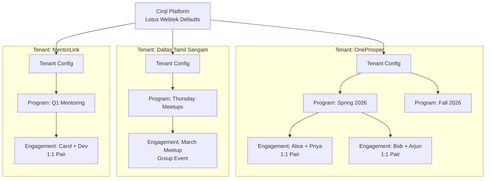

Each tenant is fully isolated: data, credentials, templates, branding, and roles do not cross tenant boundaries.

---

## 3. WABA Strategy -- Hybrid Model

### 3.1 Overview

The platform supports two WABA modes. The sending identity and quality rating isolation differ between them. Tenants choose their model at provisioning time and can migrate between them.

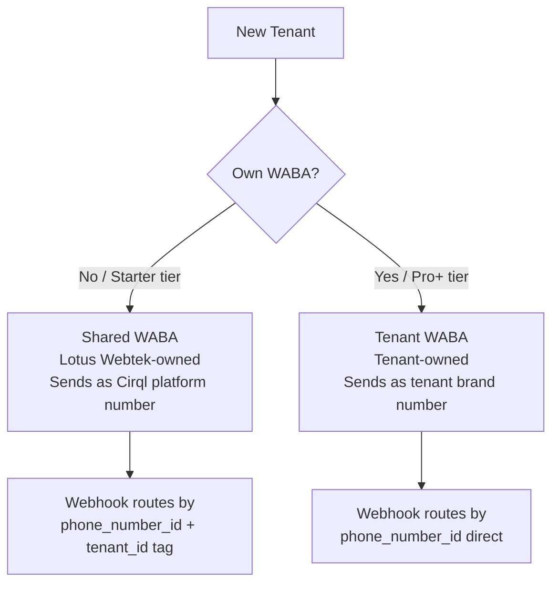

### 3.2 Shared WABA (Lotus Webtek-owned)

Lotus Webtek maintains one WABA with one or more phone numbers on the Starter tier. All Starter tenants share this WABA.

**How it works:**
- Participants receive messages from the Lotus Webtek / Cirql platform number
- All Starter templates are pre-approved under the Lotus Webtek WABA -- new tenants can go live within minutes of provisioning
- Lotus Webtek absorbs the Meta messaging costs and bills tenants via platform subscription fees
- Quality rating is shared -- high-volume or high-complaint tenants on the shared WABA affect others

**Tenant limits on shared WABA:**
- Monthly message cap enforced per tenant (configured per plan tier)
- Template customization is limited to variable values only -- body text is Lotus Webtek standard
- Sending number and display name show the platform identity, not the tenant's brand

### 3.3 Tenant-Owned WABA (Bring Your Own)

Pro and Enterprise tenants connect their own WABA via Meta Embedded Signup.

**How it works:**
- Participants receive messages from the tenant's own registered business number and display name
- Templates are submitted and approved under the tenant's WABA -- approval timelines depend on Meta
- The tenant owns the Meta business relationship and quality rating independently
- Meta messaging fees are the tenant's responsibility (billed directly by Meta to the tenant's account, or via Lotus Webtek with pass-through on Enterprise)

**Tenant capabilities with own WABA:**
- Full template body customization within Meta's rules
- Can apply for and display the Meta verified green tick badge
- Quality rating issues do not affect other tenants
- Can migrate away from Cirql platform without losing their phone number or WABA history

### 3.4 WABA Config in Data Model

`tenant_whatsapp_config` stores the resolved WABA config per tenant. `waba_mode` determines which credentials are used by the message sender.

```sql
waba_mode: 'shared' | 'tenant_owned'
-- If shared: uses platform phone_number_id + platform access_token
--            stores tenant_tag for routing inbound messages back to correct tenant
-- If tenant_owned: uses tenant's own phone_number_id + encrypted access_token
```

Inbound webhook routing:
- Tenant-owned WABAs: route by `phone_number_id` (one-to-one)
- Shared WABA: route by `phone_number_id` (platform number) + `tenant_tag` embedded in message metadata or button payload

### 3.5 Migration Path

A tenant can move from Shared to Tenant-Owned without data loss. The migration process:
1. Tenant connects their WABA via Embedded Signup in the admin UI
2. Lotus Webtek SysAdmin reviews and approves the migration
3. Templates are re-submitted under the new WABA
4. On approval, `waba_mode` is flipped and outbound routing switches
5. The old shared number is released back to the pool

---

## 4. Configuration Cascade

Settings resolve from most specific to least specific. The participant-level override is new in v4.0 -- it allows an individual participant to set their own communication preferences (language, voice vs. text) within the bounds allowed by the program.

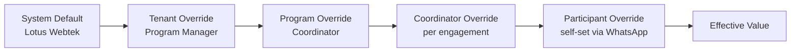

### 4.1 Configurable Settings

| Setting | Type | SYS Default | Who Can Override | OneProsper Value |
|---|---|---|---|---|
| `allowed_session_days` | day[] | Mon-Sun | TEN, PRG | [Sunday] |
| `max_sessions_per_role_a_per_week` | int | unlimited | TEN, PRG | 1 |
| `session_duration_minutes` | int | 60 | TEN, PRG, COO | 45 |
| `reminder_lead_hours` | int | 24 | TEN, PRG | 24 |
| `checkin_delay_minutes` | int | 30 | TEN, PRG | 30 |
| `nudge_timeout_minutes` | int | 120 | TEN, PRG | 120 |
| `max_session_extensions` | int | 5 | TEN, PRG | 2 |
| `max_total_weeks` | int | unlimited | TEN, PRG | 14 |
| `total_program_sessions` | int | unlimited | TEN, PRG | 10 |
| `coordinator_alert_after_misses` | int | 2 | TEN, PRG | 2 |
| `default_language` | string | en | TEN, PRG, COO, PAR | en |
| `role_a_language` | string | en | TEN, PRG, COO, PAR | en |
| `role_b_language` | string | en | TEN, PRG, COO, PAR | hi+en |
| `session_time_anchor` | enum | role_b | TEN, PRG, COO | role_b |
| `bilingual_mode` | bool | false | TEN | true |
| `require_consent` | bool | true | not overridable | true |
| `allow_self_scheduling` | bool | false | TEN, PRG | false |
| `engagement_type` | enum | one_to_one | TEN, PRG | one_to_one |
| `role_a_label` | string | "Facilitator" | TEN | "Buddy" |
| `role_b_label` | string | "Participant" | TEN | "Learner" |
| `session_label` | string | "Session" | TEN | "Session" |
| `program_label` | string | "Program" | TEN | "Cohort" |
| **`reminder_channel`** | enum | text | TEN, PRG, COO, PAR | text |
| **`voice_language`** | string | en | TEN, PRG, COO, PAR | en |
| **`voice_provider`** | string | elevenlabs | TEN | elevenlabs |
| **`voice_gender`** | enum | neutral | TEN, PRG, COO, PAR | neutral |
| **`voice_fallback_to_text`** | bool | true | TEN | true |
| `waba_mode` | enum | shared | TEN (Pro+) | shared |

> **PAR-level overrides** for `reminder_channel`, `voice_language`, and `voice_gender` can be set by the participant themselves via a WhatsApp preference flow (e.g., reply SETTINGS to any message), subject to the bounds the program allows.

### 4.2 Config Storage

```sql
-- Pseudocode resolution
effective_config = merge(
  system_defaults,
  tenant_config,
  program_config,
  coordinator_config,   -- NEW level
  participant_config    -- NEW level, most specific
)
```

---

## 5. Engagement Types

An **engagement** is the atomic unit of a program -- the "thing" that sessions happen within. The engagement type determines how participants are assigned and how the reminder and check-in flows work.

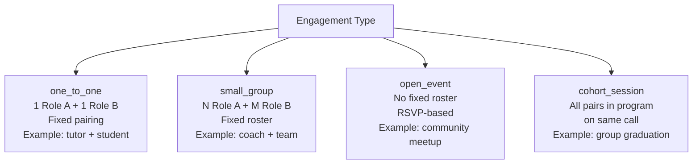

### 5.1 One-to-One (one_to_one)

The default type. One Role A participant paired with one Role B participant. Mutual confirmation required for session to proceed. This is the OneProsper model.

- Reminder sent to both
- Both must confirm (or either can cancel)
- Check-in submitted by Role A after session
- Coordinator alerted on repeated misses by either party

### 5.2 Small Group (small_group)

A fixed roster of participants (mixed roles or single role) who meet together on a recurring schedule. Example: a mentoring circle with one mentor and four mentees.

- Reminder sent to all roster members
- Quorum setting determines if session proceeds (e.g., session goes ahead if 3 of 4 confirm)
- One designated "lead" (Role A) submits check-in on behalf of the group
- RSVP tracked per participant

### 5.3 Open Event (open_event)

Community meetup or open-enrollment session. No fixed roster. Participants RSVP. Example: Dallas Tamil Sangam Thursday meetup.

- Event created by coordinator with date, time, location/link, capacity
- All active participants in the program receive invite
- RSVP tracked (yes / no / maybe)
- Reminder sent to confirmed RSVPs before event
- Post-event pulse sent to attendees
- No check-in flow -- coordinator marks event as held or cancelled

### 5.4 Cohort Session (cohort_session)

All engagements in a program share a single group session (e.g., orientation or graduation). One-time or recurring.

- All participants in the program receive reminder
- Attendance tracked per participant
- No pairing logic -- this is a broadcast + RSVP flow

### 5.5 Engagement Type in Data Model

The `engagements` table replaces the prior `pairs` table. `engagement_type` drives the flow logic.

```
engagements
  id
  tenant_id
  program_id
  engagement_type       -- one_to_one | small_group | open_event | cohort_session
  name                  -- optional label
  quorum_count          -- for small_group: min attendees to proceed
  status
  config (JSONB)        -- engagement-level overrides
```

`engagement_participants` replaces `pairs` role columns:

```
engagement_participants
  engagement_id
  participant_id
  role                  -- role_a | role_b | member (for events)
  status                -- active | paused | dropped
```

---

## 6. Voice Reminders

### 6.1 Overview

Participants can receive session reminders as WhatsApp voice messages instead of (or in addition to) text messages. Voice is generated by a TTS provider (default: ElevenLabs) and sent as a WhatsApp audio attachment alongside or instead of the text template.

This is particularly valuable for:
- Low-literacy participants (some OneProsper learners)
- Participants who prefer audio in their native language
- Community programs where participants are older or less comfortable with reading on a phone

### 6.2 Delivery Modes

`reminder_channel` controls how reminders are sent:

| Value | Behavior |
|---|---|
| `text` | Text template only (default) |
| `voice` | Voice message only |
| `text_and_voice` | Text template followed immediately by voice message |
| `voice_with_text_fallback` | Voice attempted; if generation fails, send text |

### 6.3 Config Cascade for Voice

Voice preferences follow the full 5-level cascade. A participant can override their own preferences via a WhatsApp preference flow if the program allows it.

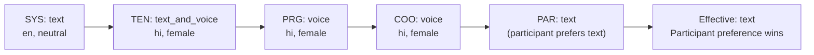

| Setting | SYS Default | Who Can Override |
|---|---|---|
| `reminder_channel` | text | TEN, PRG, COO, PAR |
| `voice_language` | en | TEN, PRG, COO, PAR |
| `voice_gender` | neutral | TEN, PRG, COO, PAR |
| `voice_provider` | elevenlabs | TEN only |
| `voice_fallback_to_text` | true | TEN |
| `voice_speed` | 1.0 | TEN, PRG, COO, PAR |

### 6.4 Voice Generation Flow

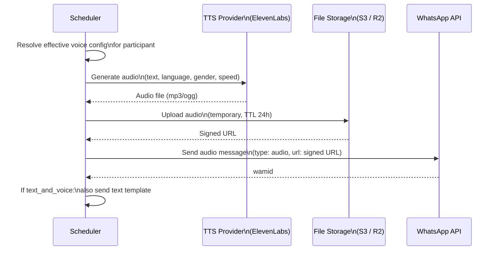

### 6.5 Participant Preference Flow

A participant can change their voice preferences by replying to any message with a keyword (configurable, e.g. "SETTINGS" or "PREFERENCES"). The system sends an interactive WhatsApp menu:

```
How would you like to receive reminders?
[Text only]  [Voice only]  [Both]

What language?
[English]  [Hindi]  [Tamil]  [Other]
```

Selections are stored in `participant_config` and applied at next send. Coordinators can see and override participant preferences in the admin UI.

### 6.6 Voice Content

Voice messages use the same template variable structure as text messages. The TTS script is generated from the template body with variables substituted, then passed to the voice provider. Bilingual voice can be handled by:
- Generating two audio clips (one per language) and concatenating
- Using a multilingual TTS model that handles code-switching (ElevenLabs supports this for some language pairs)

### 6.7 Storage and Cost

- Generated audio files are stored temporarily (24-hour TTL) -- participants are not expected to need them after the reminder window passes
- Voice generation cost is tracked per tenant for billing attribution
- `voice_messages` table logs each generation: participant, template, provider, duration, cost estimate, status

---

## 7. Roles and Permissions

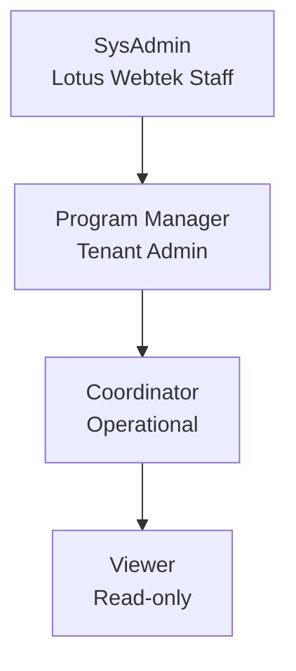

| Permission | SysAdmin | Program Manager | Coordinator | Viewer |
|---|---|---|---|---|
| Create / manage tenants | YES | no | no | no |
| Set system defaults | YES | no | no | no |
| Connect / change WABA | YES | YES (Pro+) | no | no |
| Set tenant config | YES | YES | no | no |
| Create programs | YES | YES | no | no |
| Set program config | YES | YES | YES | no |
| Create / edit engagements | YES | YES | YES | no |
| Set engagement config overrides | YES | YES | YES | no |
| Override participant preferences | YES | YES | YES | no |
| Send manual messages | YES | YES | YES | no |
| View dashboard | YES | YES | YES | YES |
| Export reports | YES | YES | YES | no |
| Manage tenant user accounts | YES | YES | no | no |
| Manage voice provider config | YES | TEN only | no | no |

---

## 8. Tenant Provisioning

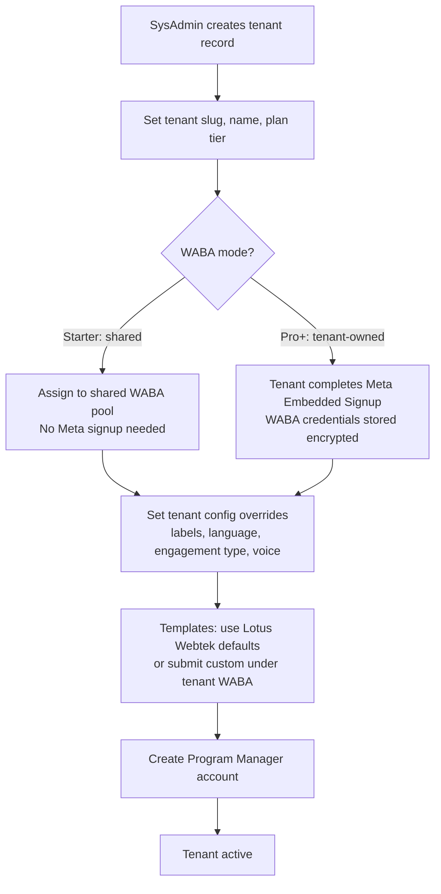

### 8.1 Plan Tiers

| Tier | WABA Mode | Included | Notes |
|---|---|---|---|
| Starter | Shared (Lotus Webtek) | Phase 1, 1 program, 200 participants | Fast onboarding, platform branding |
| Pro | Tenant-owned or shared | Phase 1+2, unlimited programs, 2000 participants | Own branding, voice reminders |
| Enterprise | Tenant-owned | All phases, unlimited, SLA, custom integrations | Annual contract |

---

## 9. Core Domain Model

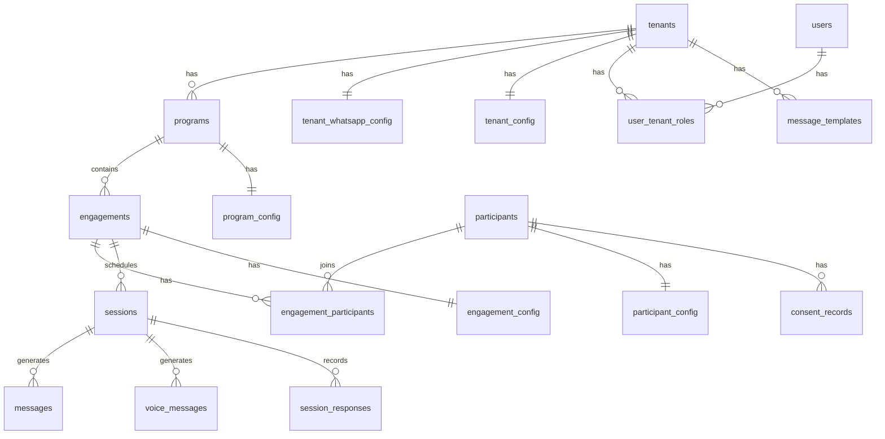

---

## 10. Data Schema

### 10.1 Core Tables

```sql
-- Tenants
create table tenants (
  id uuid primary key default gen_random_uuid(),
  slug text unique not null,
  name text not null,
  plan_tier text default 'starter',   -- starter | pro | enterprise
  status text default 'active',
  created_at timestamptz default now()
);

-- Tenant WhatsApp config (encrypted sensitive fields)
create table tenant_whatsapp_config (
  tenant_id uuid primary key references tenants(id),
  waba_mode text default 'shared',              -- shared | tenant_owned
  phone_number_id text,                         -- tenant's own, or null if shared
  waba_id text,
  access_token text,                            -- encrypted, null if shared
  webhook_verify_token text,                    -- encrypted
  tenant_tag text,                              -- routing tag on shared WABA
  business_name text,
  status text default 'pending',
  connected_at timestamptz
);

-- Tenant-level config (JSONB cascade layer 2)
create table tenant_config (
  tenant_id uuid primary key references tenants(id),
  settings jsonb not null default '{}',
  plan_features jsonb not null default '{}'
);

-- Programs (cohorts / meetup series / etc.)
create table programs (
  id uuid primary key default gen_random_uuid(),
  tenant_id uuid not null references tenants(id),
  name text not null,
  engagement_type text default 'one_to_one', -- one_to_one | small_group | open_event | cohort_session
  status text default 'draft',               -- draft | active | paused | completed | archived
  start_date date,
  end_date date,
  created_at timestamptz default now()
);

-- Program-level config (JSONB cascade layer 3)
create table program_config (
  program_id uuid primary key references programs(id),
  settings jsonb not null default '{}'
);

-- Participants (WhatsApp users only -- no platform login)
create table participants (
  id uuid primary key default gen_random_uuid(),
  tenant_id uuid not null references tenants(id),
  first_name text not null,
  last_name text,
  whatsapp_number text not null,
  role text not null,                          -- role_a | role_b | member
  status text default 'active',
  created_at timestamptz default now(),
  unique(tenant_id, whatsapp_number)
);

-- Per-participant preferences (JSONB cascade layer 5)
create table participant_config (
  participant_id uuid primary key references participants(id),
  settings jsonb not null default '{}',        -- language, voice prefs, reminder_channel
  set_by text default 'system'                 -- system | coordinator | self
);

-- Consent records (immutable)
create table consent_records (
  id uuid primary key default gen_random_uuid(),
  tenant_id uuid not null references tenants(id),
  participant_id uuid not null references participants(id),
  action text not null,                        -- granted | withdrawn
  channel text default 'whatsapp',
  recorded_at timestamptz default now(),
  recorded_by text
);

-- Engagements (replaces pairs -- supports all engagement types)
create table engagements (
  id uuid primary key default gen_random_uuid(),
  tenant_id uuid not null references tenants(id),
  program_id uuid not null references programs(id),
  engagement_type text not null,
  name text,
  session_day text,                            -- IANA weekday, for recurring types
  session_time time,                           -- UTC
  session_time_anchor text default 'role_b',  -- role_a | role_b
  quorum_count int,                            -- for small_group
  status text default 'active',
  sessions_completed int default 0,
  extensions_used int default 0,
  created_at timestamptz default now()
);

-- Engagement-level config (JSONB cascade layer 4 -- coordinator overrides)
create table engagement_config (
  engagement_id uuid primary key references engagements(id),
  settings jsonb not null default '{}'
);

-- Participants within an engagement
create table engagement_participants (
  id uuid primary key default gen_random_uuid(),
  engagement_id uuid not null references engagements(id),
  participant_id uuid not null references participants(id),
  role text not null,                          -- role_a | role_b | member
  status text default 'active',               -- active | paused | dropped
  joined_at timestamptz default now(),
  unique(engagement_id, participant_id)
);

-- Sessions (scheduled occurrences)
create table sessions (
  id uuid primary key default gen_random_uuid(),
  tenant_id uuid not null references tenants(id),
  engagement_id uuid not null references engagements(id),
  scheduled_at timestamptz not null,
  status text default 'scheduled',
  session_number int,
  cancelled_by text,
  cancellation_reason text,
  completed_at timestamptz,
  created_at timestamptz default now()
);

-- All outbound and inbound text messages
create table messages (
  id uuid primary key default gen_random_uuid(),
  tenant_id uuid not null references tenants(id),
  session_id uuid references sessions(id),
  participant_id uuid not null references participants(id),
  direction text not null,                     -- outbound | inbound
  message_type text not null,
  template_id text,
  wamid text,
  status text,
  payload jsonb,
  sent_at timestamptz,
  delivered_at timestamptz,
  read_at timestamptz
);

-- Voice message log (separate from text messages)
create table voice_messages (
  id uuid primary key default gen_random_uuid(),
  tenant_id uuid not null references tenants(id),
  session_id uuid references sessions(id),
  participant_id uuid not null references participants(id),
  message_id uuid references messages(id),     -- linked text message if text_and_voice
  language text not null,
  voice_gender text,
  voice_provider text default 'elevenlabs',
  provider_voice_id text,
  script text not null,                        -- text sent to TTS
  audio_url text,                              -- temporary signed URL
  audio_duration_seconds int,
  wamid text,
  status text,                                 -- generating | ready | sent | failed
  fallback_to_text bool default false,
  estimated_cost_usd numeric(10,6),
  created_at timestamptz default now()
);

-- Structured responses
create table session_responses (
  id uuid primary key default gen_random_uuid(),
  tenant_id uuid not null references tenants(id),
  message_id uuid not null references messages(id),
  session_id uuid references sessions(id),
  participant_id uuid not null references participants(id),
  response_type text not null,
  response_value text not null,
  responded_at timestamptz default now()
);

-- Audit log
create table audit_log (
  id uuid primary key default gen_random_uuid(),
  tenant_id uuid references tenants(id),
  actor_id uuid,
  actor_type text,                             -- user | system | participant
  action text not null,
  entity_type text,
  entity_id uuid,
  old_value jsonb,
  new_value jsonb,
  created_at timestamptz default now()
);

-- Platform users (admin UI access)
create table users (
  id uuid primary key default gen_random_uuid(),
  email text unique not null,
  name text not null,
  created_at timestamptz default now()
);

-- User roles scoped to tenant (null tenant_id = SysAdmin)
create table user_tenant_roles (
  user_id uuid not null references users(id),
  tenant_id uuid references tenants(id),
  role text not null,                          -- sysadmin | program_manager | coordinator | viewer
  granted_at timestamptz default now(),
  primary key (user_id, coalesce(tenant_id, '00000000-0000-0000-0000-000000000000'::uuid))
);

-- Message templates (scoped to tenant WABA)
create table message_templates (
  id uuid primary key default gen_random_uuid(),
  tenant_id uuid not null references tenants(id),
  template_key text not null,
  language text not null,
  category text not null,
  meta_template_name text,
  status text default 'pending',
  body text not null,
  voice_script text,                           -- TTS-optimized version if different from body
  buttons jsonb,
  variables jsonb,
  submitted_at timestamptz,
  approved_at timestamptz,
  unique(tenant_id, template_key, language)
);
```

### 10.2 Indexes

```sql
create index on sessions(tenant_id, status, scheduled_at);
create index on messages(tenant_id, participant_id, sent_at);
create index on engagements(tenant_id, program_id, status);
create index on engagement_participants(engagement_id, participant_id);
create index on session_responses(session_id, participant_id);
create index on voice_messages(tenant_id, participant_id, created_at);
create index on audit_log(tenant_id, created_at);
```

---

## 11. Engagement Engine

### 11.1 Scheduler Overview

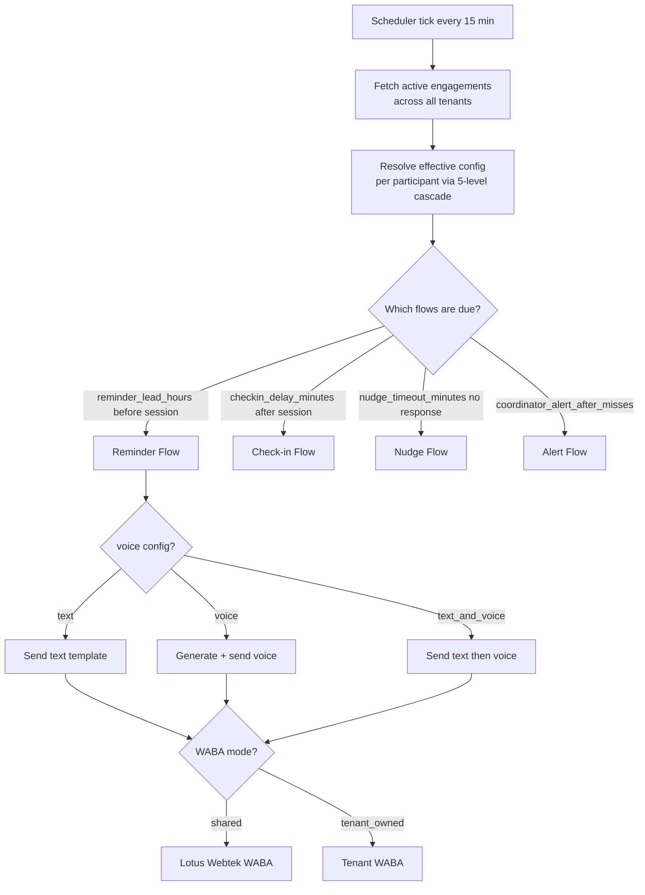

### 11.2 Flow Behavior by Engagement Type

| Flow | one_to_one | small_group | open_event | cohort_session |
|---|---|---|---|---|
| Reminder | Both Role A and Role B | All roster members | All program participants | All program participants |
| Confirmation | Mutual (both must confirm) | Quorum-based | RSVP (yes/no/maybe) | RSVP |
| Cancellation | Either party cancels | Host cancels | Coordinator cancels | Coordinator cancels |
| Check-in | Role A submits | Designated lead submits | Not applicable | Coordinator marks |
| Missed tracking | Per participant | Per quorum | Per RSVP vs. attendance | Per attendance |

### 11.3 Session State Machine

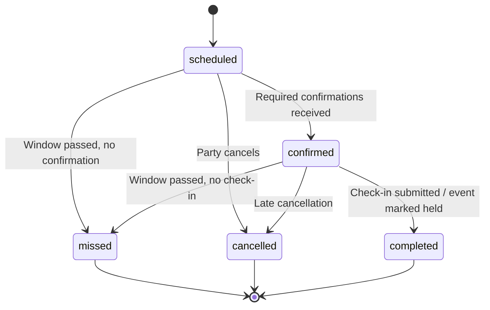

---

## 12. WhatsApp Integration

### 12.1 Multi-Tenant Webhook Routing

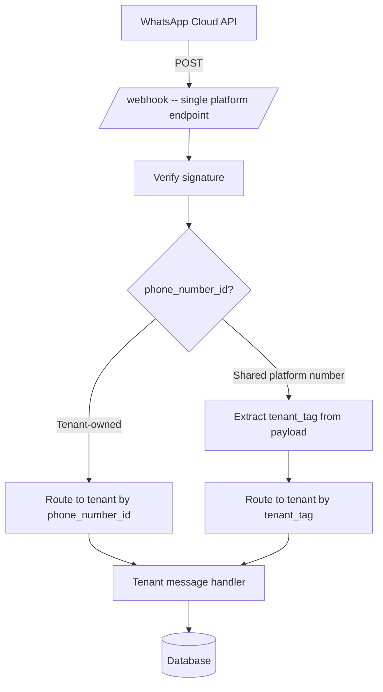

### 12.2 Inbound Participant Preference Flow

When a participant sends "SETTINGS" (or the configured keyword), the system enters a preference-setting flow:

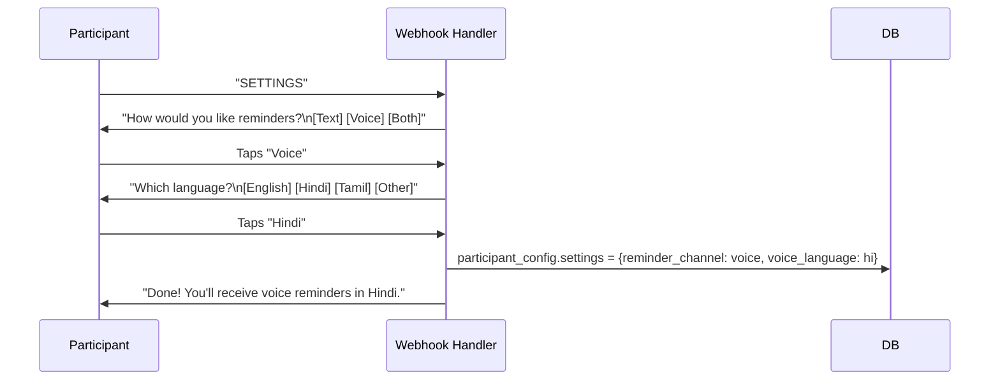

---

## 13. Message Templates

### 13.1 Template Keys

| Key | Applicable Type | Description |
|---|---|---|
| `reminder_role_a` | all | Reminder to Role A participant |
| `reminder_role_b` | all | Reminder to Role B participant |
| `reminder_member` | open_event, cohort_session | Reminder to general members |
| `confirm_role_a` | one_to_one, small_group | Confirmation to Role A |
| `confirm_role_b` | one_to_one, small_group | Confirmation to Role B |
| `cancelled_role_a` | all | Session cancelled -- notify Role A |
| `cancelled_role_b` | all | Session cancelled -- notify Role B |
| `checkin_prompt` | one_to_one, small_group | Post-session check-in to Role A |
| `checkin_nudge` | one_to_one, small_group | Nudge if no check-in response |
| `pulse_role_b` | one_to_one, small_group | Post-session satisfaction to Role B |
| `rsvp_invite` | open_event, cohort_session | RSVP invitation |
| `rsvp_reminder` | open_event, cohort_session | Reminder to confirmed RSVPs |
| `no_response_nudge` | all | Nudge when no reminder response |
| `preferences_prompt` | all | Triggered by SETTINGS keyword |
| `coordinator_alert` | all | Coordinator notification |

Each template has a `voice_script` field -- a TTS-optimized version of the same content (shorter sentences, pronunciation hints, no markdown).

### 13.2 Shared vs. Tenant-Owned Templates

| Mode | Template Body | Approval | Customization |
|---|---|---|---|
| Shared WABA | Lotus Webtek standard | Pre-approved, available immediately | Variables only |
| Tenant-owned WABA | Full customization | Submitted per tenant, 1-7 day Meta approval | Full body + buttons |

---

## 14. Admin UI

### 14.1 SysAdmin Views

- Tenant list: status, plan tier, WABA mode, WABA status
- Tenant provisioning wizard
- System defaults editor (all SYS-level settings)
- Shared WABA pool management (phone numbers, capacity, tenant assignments)
- Platform-wide message volume, error rates, voice generation costs
- Audit log viewer (all tenants)

### 14.2 Program Manager Views

- Tenant dashboard (program health)
- Tenant config editor (labels, language, voice defaults, WABA mode)
- Template management (customize, submit, track approval)
- Program management (create, configure, pause, archive)
- Program config editor
- Voice provider configuration (API keys, default voice)
- User management (coordinators, viewers)

### 14.3 Coordinator Views

- Participant list with role and voice/language preferences
- Engagement management (create engagements, assign participants, set schedule)
- Engagement config overrides
- Participant preference overrides
- Session tracker (week view by status)
- Manual message sender (text or voice)
- Coordinator alerts inbox
- Export reports

### 14.4 Config Editor UX Pattern

Each setting shows its resolved source visually:

- **System default** -- grey, "Lotus Webtek default"
- **Tenant override** -- blue badge "Set by Program Manager"
- **Program override** -- teal badge "Set at Program level"
- **Coordinator override** -- amber badge "Set by Coordinator"
- **Participant preference** -- purple badge "Set by Participant"

This makes it immediately clear, at any level of the UI, where a setting comes from and who can change it.

---

## 15. Reporting and Dashboard

### 15.1 Coordinator Dashboard

| Metric | Description |
|---|---|
| Confirmed | Engagements where required participants confirmed |
| Pending | Awaiting confirmation |
| Cancelled | Cancelled this week |
| Missed | No response, window passed |
| Completed | Check-in or event marked as held |
| Voice delivery rate | % of voice messages successfully delivered |
| Check-in rate | % of confirmed sessions with check-in submitted |

### 15.2 Program Manager Dashboard

- Session completion trend (week over week)
- Attendance by participant and by role
- No-show pattern detection
- Voice vs. text usage breakdown
- Messages sent / delivered / read / failed per channel
- Voice generation cost per program

### 15.3 SysAdmin Dashboard

- Active tenants, WABA status per tenant
- Shared WABA pool utilization
- Platform message volume (by tenant, by channel)
- Voice generation volume and costs
- Template approval status across all tenants
- Error rates

### 15.4 Export

CSV export available for all levels. Reports carry tenant branding (logo, program name), not Lotus Webtek branding.

---

## 16. Deployment Architecture

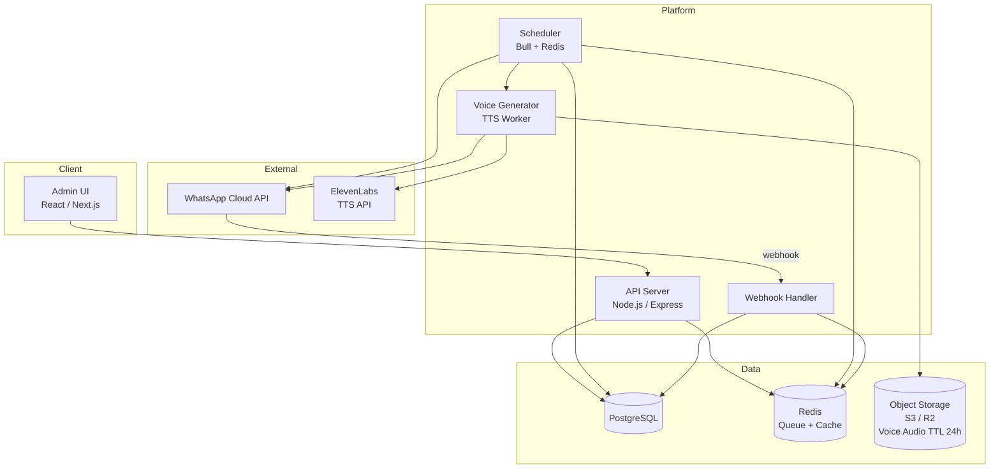

- Single deployable application (not microservices)
- Voice worker runs as a Bull queue consumer in the same process, not a separate service
- Docker + Docker Compose for all environments
- GitHub Actions CI/CD to AWS Lightsail on `main` push
- `.env.example` committed with `PORT` and all required keys; `.env` never committed

---

## 17. Phase Roadmap

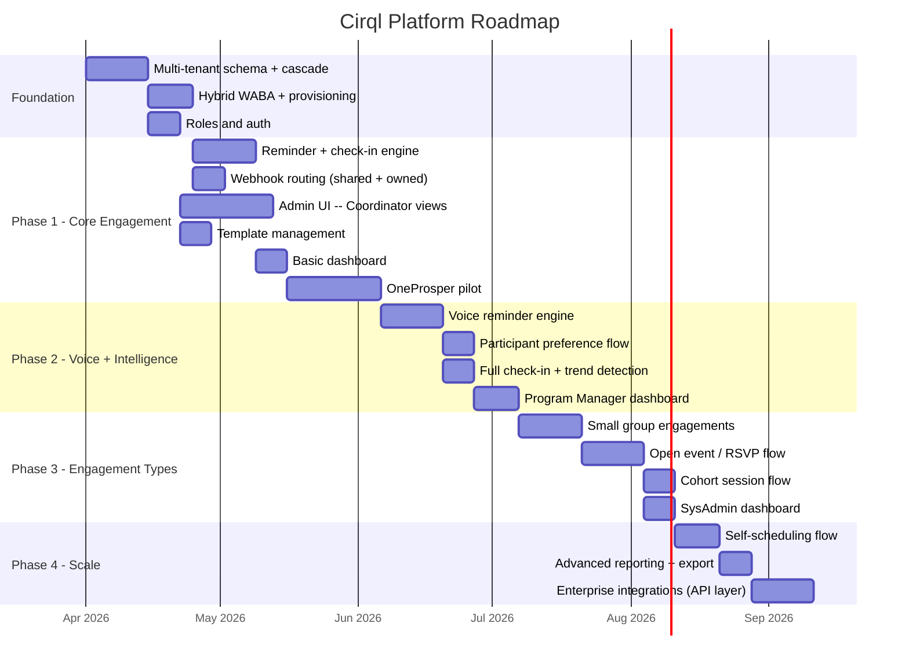

---

## 18. OneProsper Reference Configuration

OneProsper runs as a Starter-tier tenant on the shared Lotus Webtek WABA. All behavior is derived from config overrides -- no code is specific to OneProsper.

```json
{
  "tenant": {
    "name": "OneProsper",
    "slug": "oneprosper",
    "plan_tier": "starter"
  },
  "tenant_whatsapp_config": {
    "waba_mode": "shared",
    "tenant_tag": "oneprosper"
  },
  "tenant_config": {
    "settings": {
      "role_a_label": "Buddy",
      "role_b_label": "Learner",
      "session_label": "Session",
      "program_label": "Cohort",
      "allowed_session_days": ["Sunday"],
      "max_sessions_per_role_a_per_week": 1,
      "session_duration_minutes": 45,
      "reminder_lead_hours": 24,
      "checkin_delay_minutes": 30,
      "nudge_timeout_minutes": 120,
      "max_session_extensions": 2,
      "total_program_sessions": 10,
      "coordinator_alert_after_misses": 2,
      "role_a_language": "en",
      "role_b_language": "hi+en",
      "session_time_anchor": "role_b",
      "bilingual_mode": true,
      "engagement_type": "one_to_one",
      "reminder_channel": "text",
      "voice_language": "en",
      "voice_fallback_to_text": true,
      "allow_self_scheduling": false
    }
  }
}
```

When OneProsper upgrades to Pro, they can:
- Connect their own WABA (`waba_mode: "tenant_owned"`)
- Enable voice reminders (`reminder_channel: "text_and_voice"`, `role_b_language: "hi"`)
- Allow participants to set their own language and voice preferences

---

## 19. Claude Code Build Prompt

> Hand this entire PRD to Claude Code to initiate the MVP build.

---

Build the **Cirql** multi-tenant WhatsApp engagement platform as specified in this PRD.

Start with the foundation layer in this order:

1. PostgreSQL schema from Section 10, including all indexes. Use Supabase for development.

2. Configuration cascade utility from Section 4 -- a function that accepts (tenant_id, program_id, engagement_id, participant_id) and returns the fully resolved effective config by merging all five levels in order.

3. WABA routing layer from Section 3 -- the `tenant_whatsapp_config` table must support both `shared` and `tenant_owned` modes. The message sender must select the correct credentials based on `waba_mode`. The webhook handler must route by `phone_number_id` for tenant-owned, and by `tenant_tag` for shared.

4. Role-based auth from Section 7. JWT-based. SysAdmin has no tenant_id. All other roles are tenant-scoped.

5. Engagement engine from Section 11 as a Bull queue scheduler. Config must be resolved per-participant before each send. Voice generation must run as a queue consumer in the same process.

6. Voice reminder flow from Section 6. ElevenLabs as the default TTS provider. Audio stored in object storage with a 24-hour TTL. `voice_messages` table tracks every generation event.

The first working tenant is OneProsper with the configuration in Section 18. All OneProsper behavior must come from that config, not from hardcoded logic.

Apply an artist-inspired UI theme to the admin interface.

Deliver Dockerfile and docker-compose.yml as first-class outputs. Include `.env.example` with `PORT` and all required environment variable keys.

---

*Cirql PRD v4.0 -- Lotus Webtek -- Hybrid WABA, Generalized Engagement Types, Voice Reminders*
